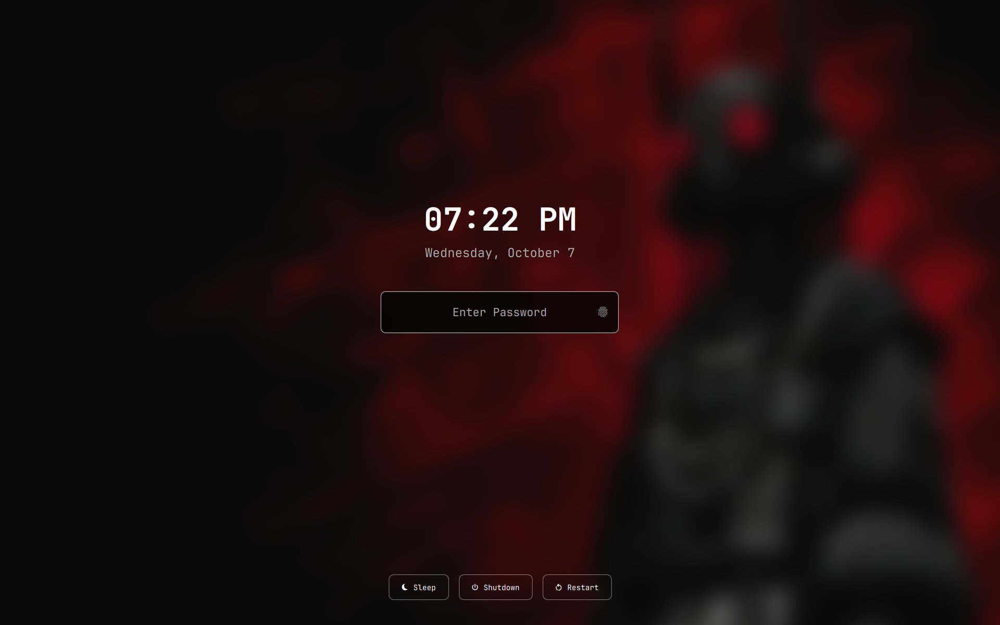

# Crossfade Lock

A personal fork of [Better Lock](https://github.com/BibekBhusal0/omarchy-better-lock) by Bibek Bhusal (MIT), which is itself a clone of Omarchy's built-in `omarchy.lock`. All the date/time display, power controls and PAM authentication work comes from Bibek's plugin; this fork changes how it looks and behaves around locking and unlocking, and trims two features.



## What this fork changes

**Added**

- **Crossfade into the lock screen.** The live desktop is grabbed (with Quickshell's native `ScreencopyView`, no subprocess) and cross-fades into the blurred lock content before the real session-lock surface maps underneath it, so there is no black flash.
- **Crossfade out on unlock.** The real lock is released first, then a pre-matched overlay fades to the desktop (200 ms). The overlay window stays mapped for the whole locked session so the unlock hand-off doesn't have to create a new surface mid-animation, which was the cause of an intermittent flicker.
- **Pre-baked blur.** The blurred wallpaper is rendered once to a cached PNG with ImageMagick whenever the wallpaper changes, instead of blurring on the GPU at every lock. A session-lock surface gets no render frames until it is mapped, so a live blur can never be ready in time.
- **Faster background load.** The wallpaper starts decoding when the lock is requested, not after the lock surface appears, which removes the black flash before the wallpaper shows.

**Removed**

- The "Forgot password" prompt.
- The integrated MPRIS media widget.

**Renamed**

- Cache and namespace paths use `archer-lock` instead of `bibek-lock`, so its cache doesn't collide with the original's. Only one lock plugin should be enabled at a time.

## Inherited from Better Lock

- Large, configurable date and time above the password field
- Shutdown / Restart / Sleep controls
- Separate password and fingerprint PAM flows
- Keyboard navigation across every control

## Requirements

- Omarchy quattro
- ImageMagick (`magick`) for the blurred background (external dependency; not bundled)
- `systemctl` for the Sleep button (`systemctl suspend`)

## Install

```bash
omarchy plugin add https://github.com/rk4500/omarchy-crossfade-lock.git --enable
omarchy plugin disable omarchy.lock   # only one lock service at a time
omarchy plugin disable bibek.lock     # if you have Better Lock installed
omarchy restart shell
```

`omarchy plugin update` pulls from this repo, not from Bibek's. Upstream changes have to be merged here by hand.

## Configuration

Options live in `~/.config/omarchy/lock.json` (watched live):

```json
{
  "timeFormat": "hh:mm AP",
  "dateFormat": "dddd, MMMM d"
}
```

## Uninstall

```bash
omarchy plugin remove io.github.rk4500.crossfade-lock
omarchy plugin enable omarchy.lock
```

## Credits

- [Better Lock](https://github.com/BibekBhusal0/omarchy-better-lock) by [Bibek Bhusal](https://github.com/BibekBhusal0) (MIT): the plugin this is forked from, including the layout, date/time and power controls. Bibek's repo also has contributions from [tug-benson](https://github.com/tug-benson).
- Omarchy's built-in `omarchy.lock` by the Omarchy team, from which Better Lock was cloned.

Licensed under the [MIT License](LICENSE); the original copyright notice is kept.
